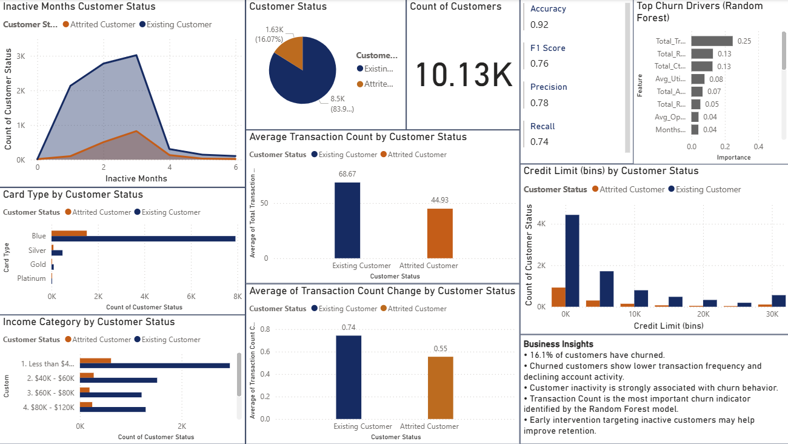

# BankChurnersProjectCA: Bank Customer Churn Analysis & Prediction
## Project Overview
This project aims to analyze customer churn behavior and develop machine learning models to predict whether a customer is likely to leave the bank. By identifying key churn drivers, the project provides actionable insights to support customer retention strategies.

## Why This Project Is Useful
Customer churn is a major challenge for banks because acquiring new customers is often more expensive than retaining existing ones. This project helps:
Identify factors associated with customer attrition.
Understand customer behavior patterns.
Predict potential churners using machine learning.
Support data-driven retention strategies.

## Dataset
The project uses the BankChurners dataset, which contains information on 10,127 bank customers, including demographics, account information, transaction behavior, and churn status.

## Methodology
### 1. Data Preparation
Data cleaning and preprocessing
Feature selection
Handling class imbalance
### 2. Exploratory Data Analysis (EDA)
Customer profile analysis
Churn distribution analysis
Transaction behavior analysis
Correlation analysis
### 3. Machine Learning Models
Logistic Regression
Random Forest Classifier
### 4. Dashboard Development
Interactive Power BI dashboard
KPI monitoring
Customer segmentation
Churn driver visualization

## Model Performance
Random Forest achieved the best performance:
Accuracy: 92%
Precision: 78%
Recall: 74%
F1 Score: 76%

## Key Findings
The customer churn rate is approximately 16%.
Churned customers perform significantly fewer transactions.
Declining transaction activity is strongly associated with churn.
Customers with higher inactivity levels are more likely to leave the bank.
Transaction behavior is the most important predictor of customer churn.

## Business Recommendations
Monitor customers with declining transaction activity.
Implement early retention campaigns for inactive customers.
Increase customer engagement through personalized offers.
Promote cross-selling opportunities to strengthen customer relationships.

## Dashboard

## Getting Started
Clone this repository.
Open the Jupyter Notebook file to review the analysis.
Run the notebook to reproduce the results.
Open the Power BI dashboard file (.pbix) to explore interactive visualizations.

## Project Structure
Bank-Churn-Analysis/
│
├── data/
│   └── BankChurnersfirst.csv
│
├── notebooks/
│   └── BankChurners_python.ipynb
│
├── dashboard/
│   └── PowerBI bank churn.pbix
│   └── BankChurnersDashboard.png
├── README.md

## Getting Help
If you have any questions or suggestions, feel free to open an issue in this repository.

## Maintainer
This project was developed and maintained by Le Dang Chau Anh as part of a Data Analytics portfolio project.

## Future Improvements
Implement XGBoost and LightGBM models.
Deploy the model as a web application.
Develop a real-time churn monitoring dashboard.
Perform advanced customer segmentation analysis.
